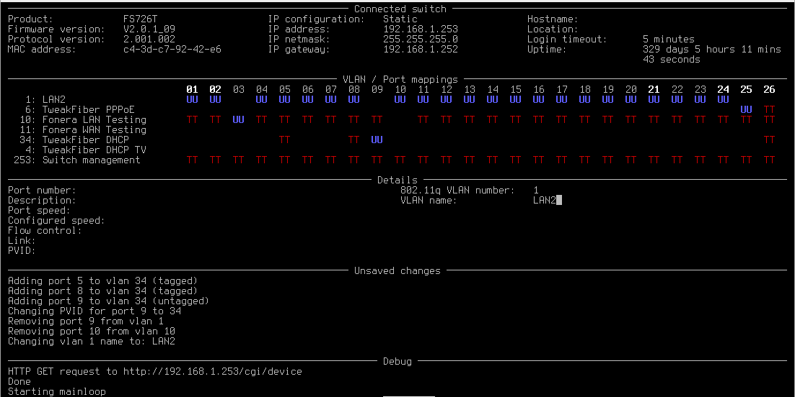

netgear-vlan-admin
==================
This is a simple "curses" interface (based on
[Urwid](http://urwid.org/)) to control Netgear FS726T smart switches
(and possibly others).

The interface offers control of the VLAN configuration in a more
convenient way, since the switch webinterface is slow and splits
configuration over different pages.

This tool works by scraping the switch's webinterface, so it is probably
not terribly robust or portable, but it works well enough.



Dependencies
------------
Python3, with a number of packages:

```
pip install configobj beautifulsoup4 urwid
```

Configuration
-------------
To configure the switch's IP address and password, modify vlan-admin.py.
Look for this line:

        switch = FS726T('192.168.1.253', 'password', config)

Additionally, the tool stores vlan names in `~/.config/vlan-admin.conf`,
since the switch itself doesn't support naming vlans.

Interface
---------
The interface consists of three interactive portions (VLAN/Port
mappings, Port details and VLAN details), which can be cycled through
using the tab key. Use the arrow keys to navigate through the mappings
and use "t", "u" and space to select tagged, untagged and not connected for
each vlan/port combination.

Use F11 to commit any pending changes and F10, or q to quit.

License
-------
This software is licensed under the MIT License:

Copyright (c) 2012-2015 Matthijs Kooijman (matthijs@stdin.nl)

Permission is hereby granted, free of charge, to any person obtaining a
copy of this software and associated documentation files (the
"Software"), to deal in the Software without restriction, including
without limitation the rights to use, copy, modify, merge, publish,
distribute, sublicense, and/or sell copies of the Software, and to
permit persons to whom the Software is furnished to do so, subject to
the following conditions:

The above copyright notice and this permission notice shall be included
in all copies or substantial portions of the Software.

THE SOFTWARE IS PROVIDED "AS IS", WITHOUT WARRANTY OF ANY KIND, EXPRESS
OR IMPLIED, INCLUDING BUT NOT LIMITED TO THE WARRANTIES OF
MERCHANTABILITY, FITNESS FOR A PARTICULAR PURPOSE AND NONINFRINGEMENT.
IN NO EVENT SHALL THE AUTHORS OR COPYRIGHT HOLDERS BE LIABLE FOR ANY
CLAIM, DAMAGES OR OTHER LIABILITY, WHETHER IN AN ACTION OF CONTRACT,
TORT OR OTHERWISE, ARISING FROM, OUT OF OR IN CONNECTION WITH THE
SOFTWARE OR THE USE OR OTHER DEALINGS IN THE SOFTWARE.

